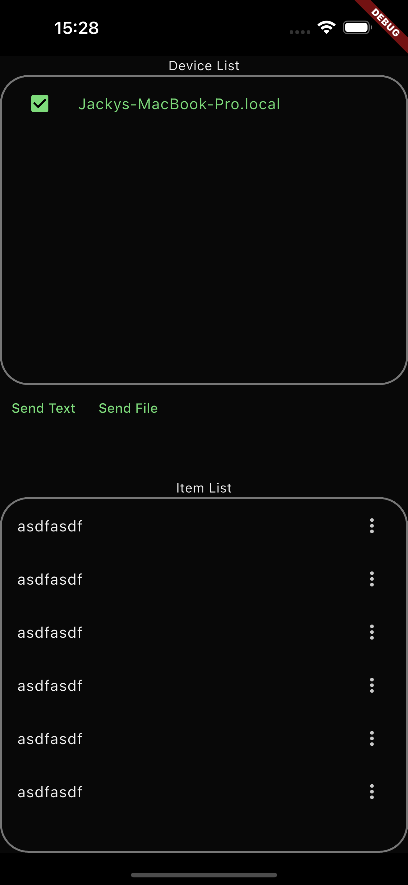

# linking

links your devices together

# How does it work

`linking` will auto scan local network with the application installed / running using `mDNS`. Which then user can select and send text / files to the selected device.

